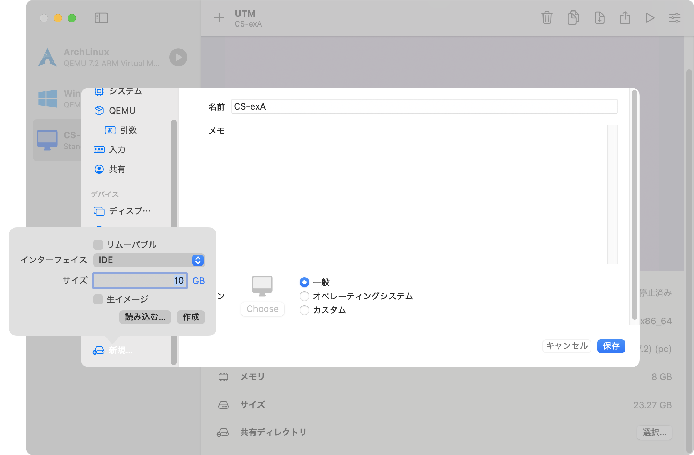

# 名大CSB3 CS実験a 

## VMイメージの変換

### Setup

```
make setup
```

### Convert

```
make conv
```

## UTMで仮想環境を起動


新規仮想マシンを作成


エミュレート


その他


なし


適当にメモリを割り振る


適当にストレージを割り振る


右クリックから編集


CPUコア数を4くらいにしてマルチコアを強制する


新規ドライブから先ほど作成したconverted.qcow2を読み込む\
ドラッグアンドドロップでconverted.qcow2を上にする


開始してしばらくすると立ち上がる

---

非常に遅いので常用は厳しい。コーディングやデバッグはMacOSの方でやってFPGAに書き込むときだけVMを使うといいと思う。

Macなら
- Icarus Verilog
- GTKWave
- cocotb
  
あたりがおすすめ
